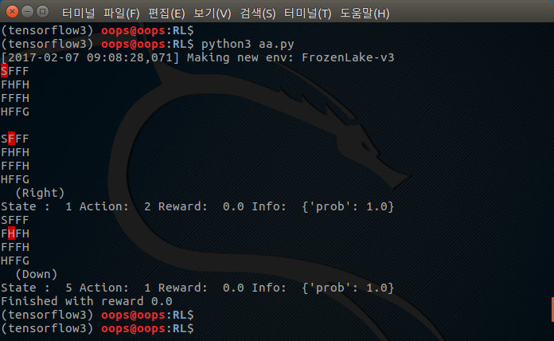
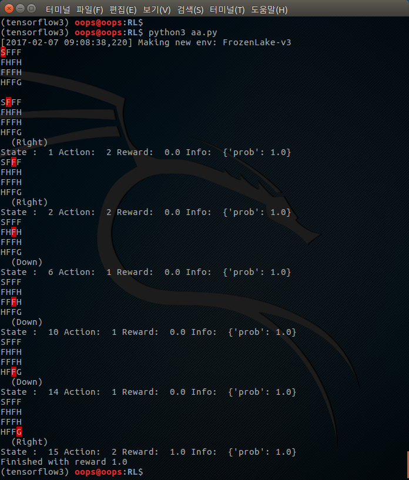

# [모두를 위한 머신러닝과 딥러닝의 강의](http://hunkim.github.io/ml/)
## Lecture 2: OpenAI GYM 게임해보기
```python
class _Getch:
    def __call__(selfself):
        fd = sys.stdin.fileno()
        old_settings = termios.tcgetattr(fd)
        try:
            tty.setraw(sys.stdin.fileno())
            ch = sys.stdin.read(3)
        finally:
            termios.tcsetattr(fd, termios.TCSADRAIN, old_settings)
            return ch

inkey = _Getch()

# MACROS
LEFT = 0
DOWN = 1
RIGHT = 2
UP = 3

# Key mapping
arrow_keys = {
    '\x1b[A' : UP,
    '\x1b[B' : DOWN,
    '\x1b[C' : RIGHT,
    '\x1b[D' : LEFT
}

try:
    import gym
except ImportError:
    print("Please install gym")
    exit(255)

from gym.envs.registration import register
import sys, tty, termios

# Register FrozenLake with is_slippery False
register(
    id = 'FrozenLake-v3',
    entry_point = 'gym.envs.toy_text:FrozenLakeEnv',
    kwargs = {'map_name' : '4x4', 'is_slippery': False}
)

env = gym.make('FrozenLake-v3')
env.render() # Show the initial board

while True:
    # Choose an action from keyboard
    key = inkey()
    if key not in arrow_keys.keys():
        print("Game aborted!")
        break

    action = arrow_keys[key]
    state, reward, done, info = env.step(action)
    env.render() # Show the board after action
    print("State : ", state, "Action: ", action, "Reward: ", reward, "Info: ", info)

    if done:
        print("Finished with reward", reward)
        break
```

### 홀에 빠졌을 때 결과 (실패)
<div style="width:50%; margin:auto; margin-bottom:10px; margin-top:20px;">

</div>

### 골에 도착 했을 때 결과 (성공)
<div style="width:50%; margin:auto; margin-bottom:10px; margin-top:20px;">

</div>
