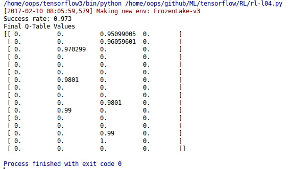
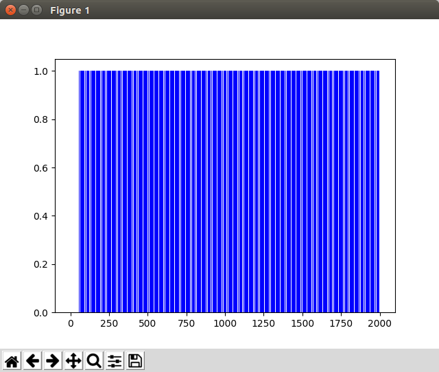
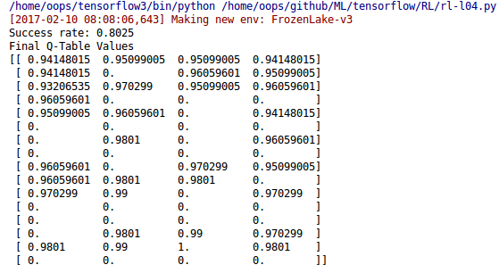
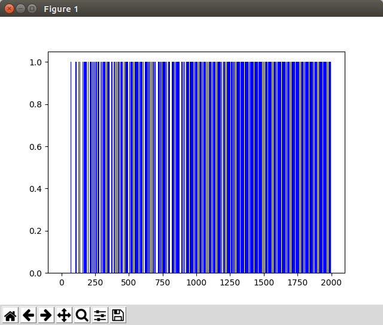

# [모두를 위한 머신러닝과 딥러닝의 강의](http://hunkim.github.io/ml/)
## Lecture 4: Q-learning (table)
exploit&exploration and discounted future reward
```python
import gym
import numpy as np
import matplotlib.pyplot as plt
from gym.envs.registration import register

register(
    id='FrozenLake-v3',
    entry_point='gym.envs.toy_text:FrozenLakeEnv',
    kwargs={'map_name': '4x4',
            'is_slippery': False}
)

env = gym.make('FrozenLake-v3')

# Initialize table with all zeros
Q = np.zeros([env.observation_space.n, env.action_space.n])
# Discount factor
dis = .99
# Set learning parameters
num_episodes = 2000

# create lists to contain total rewards and steps per episode
rList = []
for i in range(num_episodes):
    # Reset environment and get first new observation
    state = env.reset()
    rAll = 0
    done = False

    e = 1. / ((i // 100)+1)
    # The Q-Table learning algorithm
    while not done:
        # Choose an action by e greedy
        if np.random.rand(1) < e:
            action = env.action_space.sample()
        else:
            action = np.argmax(Q[state, :])

		# Q-learning 사용시 활성화 (바로 위 조건문 대신)
        #action = np.argmax(Q[state, :] + np.random.randn(1, env.action_space.n) / (i + 1))

        # Get new state and reward from environment
        new_state, reward, done,_ = env.step(action)

        # Update Q-Table with new knowledge using decay rate
        Q[state,action] = reward + dis * np.max(Q[new_state,:])

        rAll += reward
        state = new_state

    rList.append(rAll)

print("Success rate: " + str(sum(rList)/num_episodes))
print("Final Q-Table Values")
#print("LEFT DOWN RIGHT UP")
print(Q)

# edgecolor가 없으면 python2 에서 그래프가 검은색으로 표기된다.
plt.bar(range(len(rList)), rList, color="blue", edgecolor='none') 
plt.show()
```

### Code: Q learning
#### 실행 결과
<div style="width:50%; margin:auto; margin-bottom:10px; margin-top:20px;">

</div>

#### 그래프
<div style="width:50%; margin:auto; margin-bottom:10px; margin-top:20px;">

</div>

### Code: e-greedy
#### 실행 결과
<div style="width:50%; margin:auto; margin-bottom:10px; margin-top:20px;">

</div>

#### 그래프
<div style="width:50%; margin:auto; margin-bottom:10px; margin-top:20px;">

</div>

#### 실행 화면
30초 화면이라 짧지만, 뒤로 갈수록 실패가 적어진다. 테스트에서 사용된 episodes가 2000이니까 약 10~20%에 해당하는 count(100~200)가 진행된 이후로는 성공이 실패를 역전하게 된다.
<div style="width:50%; margin:auto; margin-bottom:10px; margin-top:20px;">

</div>
