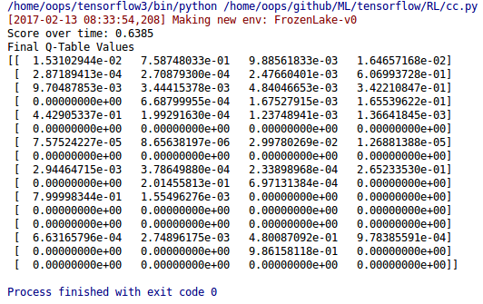
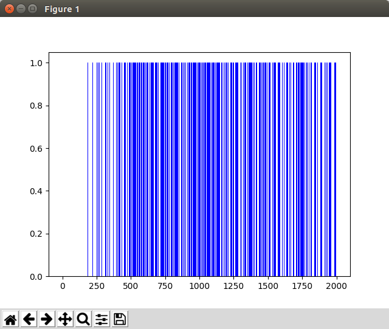

# [모두를 위한 머신러닝과 딥러닝의 강의](http://hunkim.github.io/ml/)
## Lecture 5: Q-learning in non-deterministic world
```python
import gym
import numpy as np
import matplotlib.pyplot as plt

env = gym.make('FrozenLake-v0')

# Initialize table with all zeros
Q = np.zeros([env.observation_space.n, env.action_space.n])

# Set learning parameters
learning_rate = .85
dis = .99
num_episodes = 2000

# create lists to contain total rewards and steps per episode
rList = []
for i in range(num_episodes):
    # Reset environment and get first new observation
    state = env.reset()
    rAll = 0
    done = False

    # The Q-Table learning algorithm
    while not done:
        # Choose an action by greedily (with noise) picking from Q table
        action = np.argmax(Q[state, :] + np.random.randn(1, env.action_space.n) / (i + 1))

        # Get new state and reward from environment
        new_state, reward, done,_ = env.step(action)

        # Update Q-Table with new knowledge using learning rate
        Q[state,action] = (1-learning_rate) * Q[state,action] \
            + learning_rate*(reward + dis * np.max(Q[new_state, :]))

        rAll += reward
        state = new_state

    rList.append(rAll)

print("Score over time: " + str(sum(rList)/num_episodes))
print("Final Q-Table Values")
print(Q)
plt.bar(range(len(rList)), rList, color="blue")
plt.show()
```

### Code: Q learning
#### 실행 결과
<div style="width:50%; margin:auto; margin-bottom:10px; margin-top:20px;">

</div>

#### 그래프
<div style="width:50%; margin:auto; margin-bottom:10px; margin-top:20px;">

</div>
