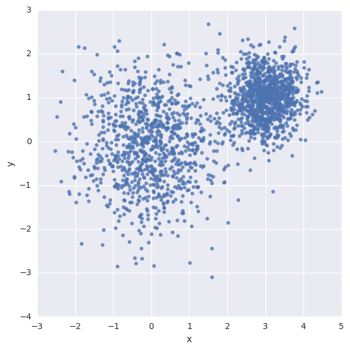
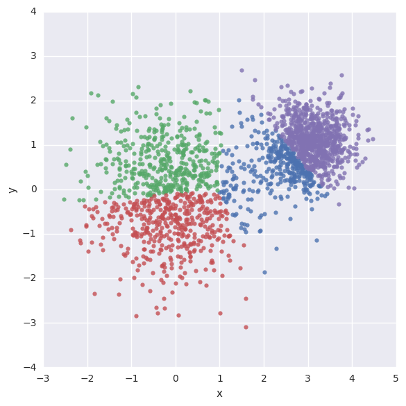

# 군집화 (clustering)

## [[텐서플로 첫걸음]](https://tensorflowkorea.wordpress.com/%ED%85%90%EC%84%9C%ED%94%8C%EB%A1%9C-%EC%B2%AB%EA%B1%B8%EC%9D%8C/) 3.3 K-평균 알고리즘
K-평균 알고리즘은 군집화 문제를 풀기 위해 적합한 알고리즘으로 주어진 데이터를 군집 개수(K)로 그룹화하는 것이 특징입니다.
당연한 이야기지만 군집되어 있는 데이터끼리는 같은 성질을 가지며 다른 그룹과는 구별됩니다. 한 개 그룹에 포함된 데이터는 다른 그룹에 군집 될 수 없습니다.

책의 예제를 순서대로 진행합니다.

### 샘플 데이터 생성 (2D 좌표계에 2,000개의 랜덤한 점)
```python
import numpy as np

num_points = 2000
vectors_set = []

for i in xrange(num_points):
    if np.random.random() > 0.5:
        vectors_set.append([np.random.normal(0.0, 0.9),
                            np.random.normal(0.0, 0.9)])
    else:
        vectors_set.append([np.random.normal(3.0, 0.5),
                            np.random.normal(1.0, 0.5)])
```

### 데이터를 그림으로 표현
```python
import matplotlib.pyplot as plt
import pandas as pd #  needs "pip install pandas"
import seaborn as sns # needs "pip install seaborn"

df = pd.DataFrame({"x": [v[0] for v in vectors_set],
                   "y": [v[1] for v in vectors_set]})
sns.lmplot("x", "y", data=df, fit_reg=False, size=6)
plt.show()

except ImportError:
  print("Please install pandas, seaborn to visualize embeddings.")
```
<div style="width:50%; margin:auto; margin-bottom:10px; margin-top:20px;">

</div>

### 위의 데이터를 TensorFlow로 4개의 군집으로 그룹화
```python
import tensorflow as tf

# 위에서 무작위로 생성한 데이터를 가지고 상수 텐서를 만듭니다.
vectors = tf.constant(vectors_set)

# 0단계 : K개 중심의 초기 집합을 결정
# tf.slice : 텐서의 일부분을 삭제합니다.
# tf.random_shuffle : 첫 번째 차원을 기준으로 텐서의 원소를 섞습니다.
k = 4
centroides = tf.Variable(tf.slice(tf.random_shuffle(vectors), [0,0],[k,-1]))

# 아래 tf.sub를 계산하기 위해 차원을 추가하는 과정입니다.
# tf.expand_dims : 텐서에 차원을 추가
expanded_vectors = tf.expand_dims(vectors, 0)
expanded_centroides = tf.expand_dims(centroides, 1)

# 1단계 : 각 데이터를 가장 가까운 군집에 할당
assignments = tf.argmin(tf.reduce_sum(tf.square(tf.sub(expanded_vectors, expanded_centroides)), 2), 0)

# 2단계 : 각 그룹에 대해 새로운 중심을 계산
# tf.reshape : 텐서의 원소는 그대로 유지하면서 텐서의 구조를 바꿉니다.
means = tf.concat(0, [tf.reduce_mean(tf.gather(vectors,
        tf.reshape(tf.where(tf.equal(assignments, c)), [1,-1])),
        reduction_indices=[1]) for c in xrange(k)])

update_centroides = tf.assign(centroides, means)

init_op = tf.initialize_all_variables()

sess = tf.Session()
sess.run(init_op)

for step in xrange(100):
    _, centroid_values, assignment_values = sess.run([update_centroides, centroides, assignments])

```

### 데이터를 그림으로 표현
```python
data = {"x": [], "y": [], "cluster": []}

for i in xrange(len(assignment_values)):
    data["x"].append(vectors_set[i][0])
    data["y"].append(vectors_set[i][1])
    data["cluster"].append(assignment_values[i])

df = pd.DataFrame(data)
sns.lmplot("x", "y", data=df, fit_reg=False, size=6, hue="cluster", legend=False)

plt.show()
```
<div style="width:50%; margin:auto; margin-bottom:10px; margin-top:20px;">

</div>
