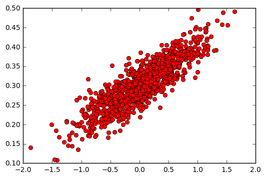
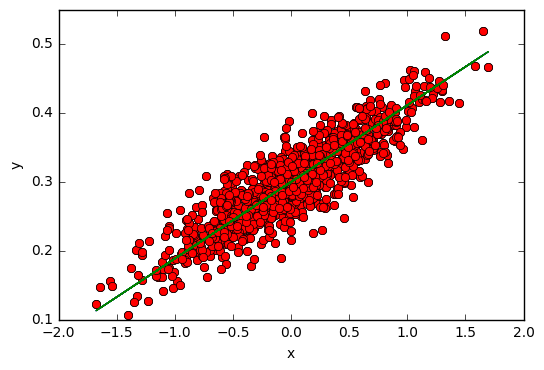

# 선형회귀분석(renear regression)

## [텐서플로 첫걸음] 2.1 변수 간의 관계에 대한 모델

```python
import numpy as np

num_points = 1000
vectors_set = []

for i in xrange(num_points):
    x1 = np.random.normal(0.0, 0.55)
    y1 = x1 * 0.1 + 0.3 + np.random.normal(0.0, 0.03) # np.random.normal() = 정규분포
    vectors_set.append([x1, y1])

x_data = [v[0] for v in vectors_set]
y_data = [v[1] for v in vectors_set]
```

### 데이터를 그림으로 표현
```python
import matplotlib.pyplot as plt # needs "pip install matplotlib"

plt.plot(x_data, y_data, 'ro')
plt.legend()
plt.show()
```
<div style="width:50%; margin:auto; margin-bottom:10px; margin-top:20px;">

</div>

## [텐서플로 첫걸음] 2.2 비용함수와 경사 하강법 알고리즘

```python
# 2.1 예제 이후에 이어지는 내용입니다.
import tensorflow as tf

W = tf.Variable(tf.random_uniform([1], -1.0, 1.0))
b = tf.Variable(tf.zeros([1]))
y = W * x_data + b

# 비용함수를 계산합니다.
loss = tf.reduce_mean(tf.square(y - y_data))

# 경사 하강법 알고리즘을 사용 
optimizer = tf.train.GradientDescentOptimizer(0.5)

# 알고리즘의 최저값을 찾습니다.
train = optimizer.minimize(loss)

# Variable이 사용되었다면 아래처럼 초기화를 진행해야 합니다.
init = tf.initialize_all_variables()

sess = tf.Session()
sess.run(init)

for step in xrange(8):
    sess.run(train)   
    print sess.run(W), sess.run(b)

'''
print 결과 
[ 0.13282794] [ 0.30009764]
[ 0.12321223] [ 0.29985777]
[ 0.11645306] [ 0.29973677]
[ 0.11170244] [ 0.29965174]
[ 0.10836352] [ 0.29959196]
[ 0.10601678] [ 0.29954997]
[ 0.10436741] [ 0.29952043]
[ 0.10320815] [ 0.29949969]
'''
```

### 데이터를 그림으로 표현
```python
plt.plot(x_data, y_data, 'ro')
plt.plot(x_data, sess.run(W) * x_data + sess.run(b))
plt.legend()
plt.xlabel('x')
plt.ylabel('y')
plt.show()
```
<div style="width:50%; margin:auto; margin-bottom:10px; margin-top:20px;">

</div>

### 학습 데이터 테스트
학습을 마친 후 새로운 데이터에 대해 정확한 분류가 되는지 확인합니다.
```python
test_set = [1,2,3]
print sess.run(W * test_set + b)

# Output
# [ 0.38831764  0.47651452  0.56471133]
```
